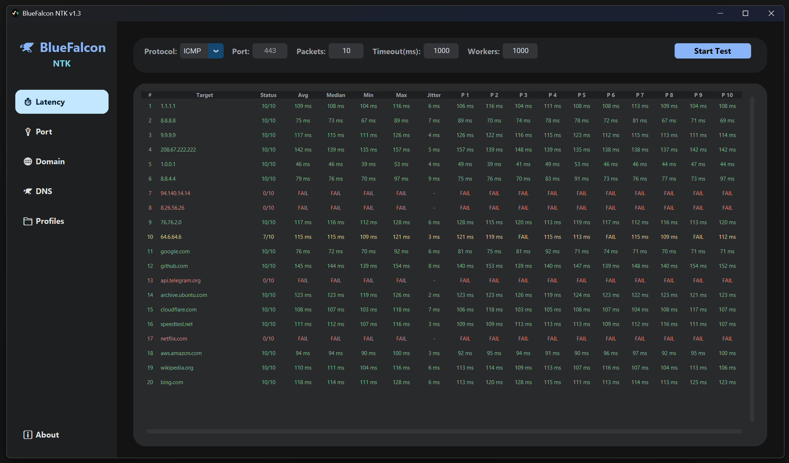

<div align="center">

# 🦅 BlueFalcon NTK

**A powerful, lightning-fast, and extremely easy-to-use application designed for testing and analyzing network performance.**


[](https://github.com/your-username/BlueFalcon-NTK/releases)
[](LICENSE)

<br />
</div>

Whether you're a gamer trying to find the best DNS server, or a system admin checking if your ports are open, this app does it all from one sleek interface! It features a multi-threaded engine capable of hundreds of concurrent tests, returning results in seconds, all wrapped in a modern Material Design 3 Dark Theme.



## 🚀 How to Use

**Step 1: Download**
* Navigate to the **Releases** section of this repository.
* Download the compiled `.exe`. No installation is required.

**Step 2: The Tools**
* **⏱️ Latency Tab:** Type in an IP or website, pick your protocol (ICMP or TCP), set your packet count, and hit start. It will show you your min, max, average ping, and jitter.
* **🔌 Port Tab:** Type in a target and the ports you want to check (like `80, 443, 8000-8010`). It will quickly blast through them and tell you exactly what's open.
* **🌐 Domain Tab:** Type in a website name to resolve it into IP addresses. You can toggle "Custom DNS" to use two specific DNS servers for the lookup instead of your computer's default.
* **🦅 DNS Tab:** This tests how fast your DNS servers are! Just hit start, and it will race all your configured DNS servers against your configured domains to see which DNS responds the fastest. Click the "🔽 Sort" button to instantly put the winner at the top.

**Step 3: Importing Your Own Lists (Profiles Tab)**
* Go to the **📁 Profiles** tab.
* Click **Reset to Default** to get a template, or start typing your own lists of IPs, Domains, and DNS servers into the big text box.
* Click **Save & Format**. The app will organize them perfectly! From now on, whenever you run a test, your custom lists will automatically be loaded.

<br>

## ✨ Features

* **Super Fast:** It does hundreds of tests at the exact same time, so you get your results in seconds, not minutes.
* **Latency Tester:** Easily check your ping to any IP address or domain using either standard ICMP (Ping) or TCP.
* **Port Scanner:** Quickly scan a website or IP to see exactly which doors (ports) are open or closed.
* **Domain Resolver:** Find every hidden IP address that runs a website, forcing it to use specific DNS servers if needed.
* **DNS Benchmark:** Find out which DNS server is actually the fastest for *you*. 
* **Easy Profiles:** Save all your favorite IPs, websites, and DNS servers into a single file so you never have to type them twice.
* **Modern Dark Mode:** A beautiful, responsive interface that's easy on the eyes.

<br>

## 💻 For Developers

Ensure you are running **Python 3.10+** on Windows.

1. **Install dependencies:**
```cmd
pip install customtkinter dnspython
```

2. **Launch Suite:**
```cmd
python main.py
```

### PyInstaller Compilation (.exe)

You can compile your own standalone executable complete with the custom icon by running:

```cmd
pip install pyinstaller
pyinstaller --noconsole --onefile --icon="icon.ico" --add-data "icon.ico;." --name "BlueFalcon NTK v1.5" "main.py"
```

<br>

## ✅ Supported Systems

* **Windows 11:** Fully Supported 
* **Windows 10:** Fully Supported
