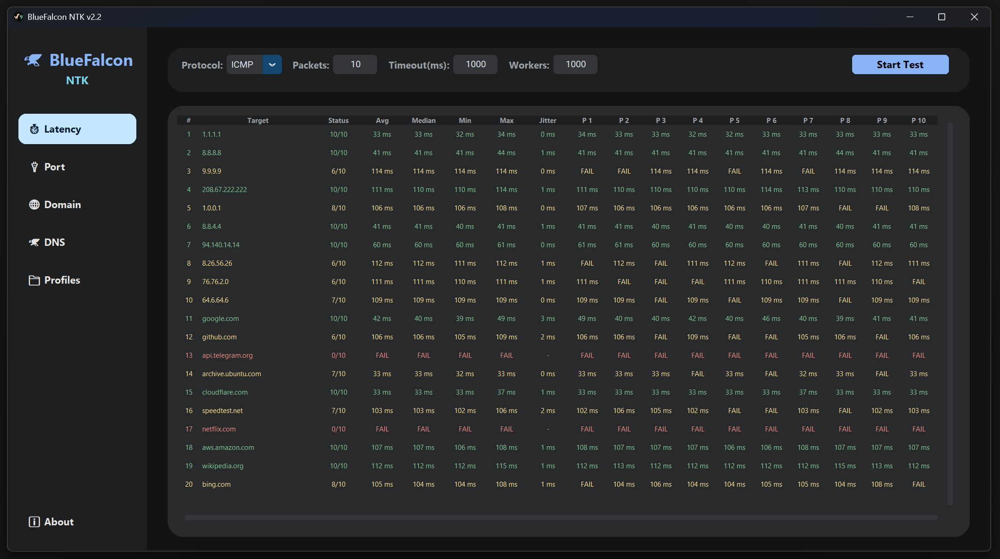

# 🦅 BlueFalcon Network Toolkit

**The ultimate network diagnostics toolkit for Windows, featuring DPI-aware scanning and concurrent DNS benchmarking.**

 

## 📖 About
A native Windows toolkit designed for advanced network diagnostics. It includes a multi-threaded, DPI-aware Latency Scanner to bypass deep packet inspection filters, and a blazing fast concurrent DNS resolution benchmarking tool. All wrapped in a modern, dark-mode CustomTkinter interface.

 

## 📸 Screenshot

 

## 🚀 How to Use
1. **Download:** Go to the **[Releases](../../releases/latest)** tab and download the latest executable.
2. **Run:** Double-click the downloaded `.exe` file (no installation required).
3. **Enjoy:** Select your tool (Latency Scanner or DNS Benchmark) from the sidebar and start testing.

 

## ✨ Features
- **DPI-Aware TCP-L7 Scanning:** Accurately measure server latency and bypass Deep Packet Inspection systems that fake SYN-ACK responses.
- **Concurrent DNS Benchmarking:** Test dozens of public and private DNS servers simultaneously to find the fastest resolvers for your specific connection.
- **Modern Interface:** A clean, intuitive dashboard with sortable data tables and quick-copy functionality.

 

## 💻 Supported Systems
| Operating System | Compatibility |
| :--- | :---: |
| **Windows 10** | ✅ |
| **Windows 11** | ✅ |

 

## 📺 Video Tutorial
*(A video tutorial is coming soon! Check back later for a link to the YouTube walkthrough.)*

 

## ☕ Support & Donate
If you find this tool helpful and want to support its continued development, consider buying me a coffee or donating via crypto!

- **Gram on ton:** `UQAQ1fZyX_EAcz0Q5z7sEfQxE0SCrVfycq5spWz0OQIOtrJl`
- **Solana:** `CRrd7ABM8ZMLNDPvo6Jkq354FpqoUFcNmuN74ztCUcM1`
- **Ethereum:** `0x1ec913bb2a65968945103da1734e987a9d1926d8`

---

<i>Created by BlueFalcon</i>

